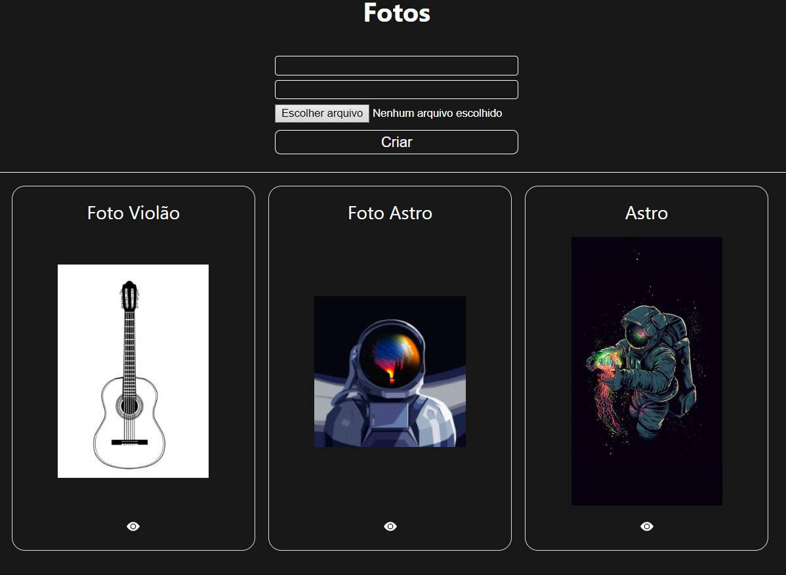
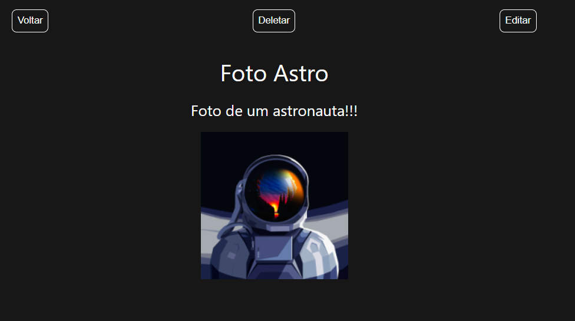
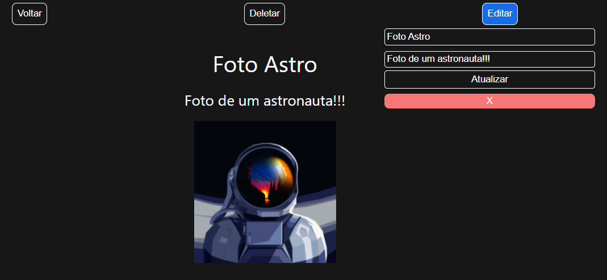
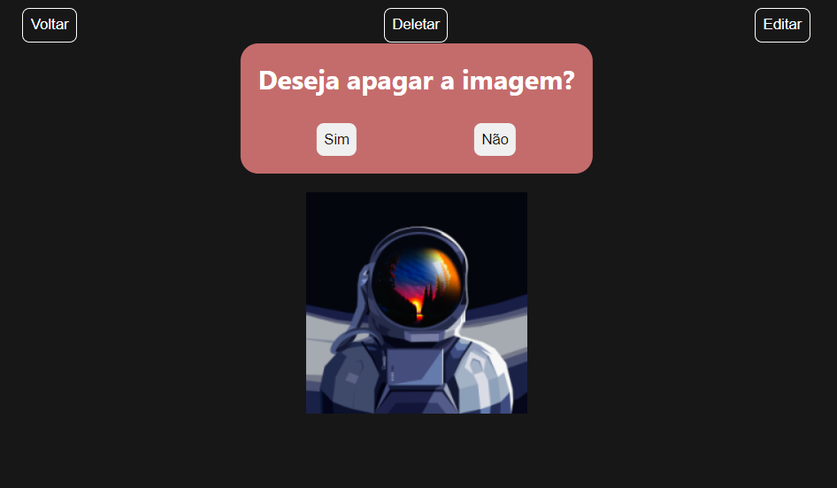

# Galeria de fotos
## Telas do projeto

<div float="left">
    
     <br />
    
    
</div>

## Sobre
<p>Projeto feito para treinar minhas habilidades em Node e React e principalmente em instruções SQL, visto que não utilizo nenhum ORM.</p>
<p>Consiste em uma aplicação de galeria de fotos. O usuário pode adicionar, remover, atualizar e ver suas fotos.</p>

# Tecnologias utilizadas
## Back end
- Nodejs/ Express
- MySQL

## Front end
- React
- Context API

# Executando o projeto
## Back end
```bash
# clonar o projeto
git clone https://github.com/diegocruz-s/photosgalery

# entrar no diretório
cd backend

# criar arquivo .env na raíz do diretório back end e passar as informações conforme o arquivo .env.test

# instalar as dependências 
npm install

# rodar o back end
npm start
```

## Front end
```bash
# entrar no diretório
cd frontend

# instalar as dependências
npm install

# rodar o projeto
npm start
```

# Autor
<p>Diego Cruz's</p>
<a href="https://www.linkedin.com/in/diegoscruz/" target="_blank">https://www.linkedin.com/in/diegoscruz/</a>